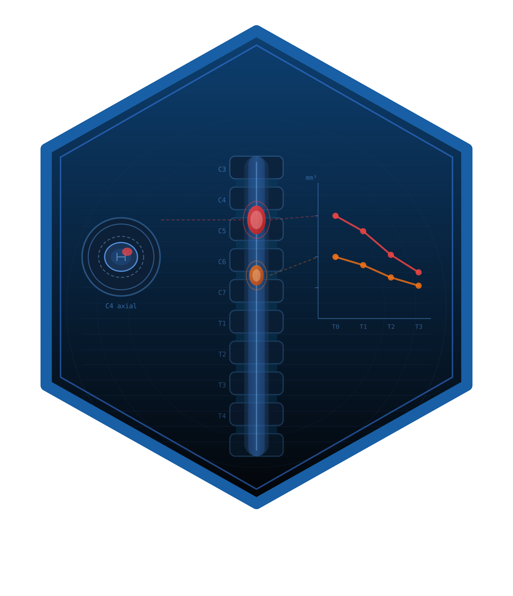

# scimagR 

<!-- badges: start -->
[](https://github.com/CTTIR/scimagR/actions/workflows/R-CMD-check.yaml)
[](https://cttir.github.io/scimagR/)
[](https://CRAN.R-project.org/package=scimagR)
[](https://app.codecov.io/gh/CTTIR/scimagR?branch=main)
[](https://cran.r-project.org/package=scimagR)
[](https://cran.r-project.org/package=scimagR)
[](https://opensource.org/licenses/MIT)
[](https://lifecycle.r-lib.org/articles/stages.html#experimental)
<!-- badges: end -->

An end-to-end R pipeline for longitudinal MRI and CT analysis in spinal cord
injury (SCI) research. Provides R wrappers for the Spinal Cord Toolbox (SCT),
DICOM tools, SCI-specific clinical metrics, and pipeline orchestration with
built-in quality control.

## Installation

Install from GitHub:

```r
# install.packages("pak")
pak::pak("cttir/scimagR")
```

## Prerequisites

scimagR requires the following external tools:

| Tool | Version | Purpose |
|------|---------|---------|
| [Spinal Cord Toolbox](https://spinalcordtoolbox.com) | >= 6.4 | Segmentation, labeling, parameter extraction |
| [dcm2niix](https://github.com/rordenlab/dcm2niix) | any | DICOM to NIfTI conversion |
| Python 3 + pydicom | any | DICOM metadata extraction & anonymization |

Verify installation:

```r
library(scimagR)
check_sct()
check_dcm2niix()
check_pydicom()
```

## Quick Start

```r
library(scimagR)

# 1. Create a new project
sci_create_project(
  "~/projects/my-sci-study",
  title = "Cervical SCI Longitudinal MRI",
  author = "Your Name"
)

# 2. Place DICOMs in data/raw/dicom/, fill registry CSVs

# 3. Run the pipeline
sci_run_pipeline("~/projects/my-sci-study")
```

## Modules

| Module | Key Functions | Description |
|--------|---------------|-------------|
| **SCT Interface** | `sct_segment_sc()`, `sct_segment_lesion()`, `sct_label_vertebrae()` | R wrappers for all SCT CLI commands |
| **DICOM Tools** | `extract_dicom_metadata()`, `anonymize_dicom()`, `convert_dcm2niix()` | Metadata extraction, anonymization, conversion |
| **SCI Metrics** | `compute_mscc()`, `compute_compression_ratio()`, `classify_phase()` | Domain-specific clinical measures |
| **Registry** | `create_registry()`, `validate_registry()`, `coverage_matrix()` | Structured time-point tracking |
| **QC System** | `filter_evaluable()`, `log_exclusion()`, `integrity_summary()` | Artifact grading and exclusion tracking |
| **Visualization** | `theme_sci()`, `scale_colour_phase()`, `plot_violin_box()` | Publication-ready figures |
| **Pipeline** | `sci_run_pipeline()`, `sci_pipeline_status()` | Orchestration with resume support |
| **Scaffold** | `sci_create_project()` | Workflowr project setup |

## Citation

If you use scimagR in your research, please cite:

```
Heller R (2026). scimagR: Spinal Cord Injury Imaging Pipeline for MRI and
CT Analysis in R. R package version 0.1.0.
https://github.com/cttir/scimagR
```

## Use of LLM tools

Portions of this package were prepared with assistance from large language model tooling for
narrowly defined, non-authorial tasks: copyediting, prose smoothing, Markdown/LaTeX formatting,
scaffolding of boilerplate files (CI configs, build scripts), code refactoring. The tools used were [Chat AI](https://kisski.gwdg.de/leistungen/2-02-llm-service/),
the LLM service of KISSKI (GWDG), and a self-hosted **Mistral Small (24B, Apache-2.0)** run locally via
[Ollama](https://ollama.com/) and the `ollamar` R package — local inference only, with no data sent to
third parties for the self-hosted model.

All scientific claims, methodological choices, analyses, interpretations, and conclusions are the
author's own. No LLM-generated text was incorporated without review and revision, and every reference
was verified against its DOI, arXiv ID, or ISBN.

## License

MIT
